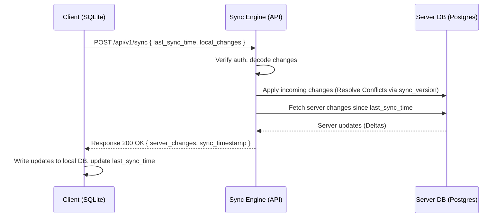

# DailyTask - API Design Specification

This document details the RESTful API endpoints, request/response JSON schemas, authentication, and synchronization protocol for **DailyTask**, derived directly from the application's `vision.md`, `user-flow.md`, and `database.md`.

---

## 1. Global API Standards

### 1.1 Architecture & Formatting
* **Protocol**: HTTP/1.1 or HTTP/2 over TLS (HTTPS).
* **Payload Format**: `application/json` for all request and response bodies.
* **Date-Time Format**: ISO 8601 UTC string format (`YYYY-MM-DDTHH:MM:SSZ`).
* **ID Format**: Universally Unique Identifier (**UUID v4**).
* **Standard Response Envelope**:
  * Successful requests return data directly or inside a `data` object.
  * Failed requests return a standardized RFC 7807 problem details object.

### 1.2 Authentication (Multi-User Ready)
All endpoints (except public/auth routes) require a JSON Web Token (JWT) passed in the HTTP Authorization header:
```http
Authorization: Bearer <JWT_TOKEN>
```
The server extracts the `owner_id` from the JWT claims to isolate data queries, matching the database's `owner_id` design.

### 1.3 API Versioning & Deprecation Policy
* **Current Version**: `v1` (Base URL path prefix: `/api/v1/`).
* **Future Versions**: Major structural changes will trigger new versions (e.g., `/api/v2/`, `/api/v3/`).
* **Deprecation Protocol**:
  * When a version is marked for deprecation, the API will include standard HTTP response headers:
    * `Deprecation: <Date>`: Indicates the date when support was deprecated.
    * `Sunset: <Date>`: Indicates the final date when the endpoint will be terminated.
  * **Support Window**: Older major versions are officially supported and maintained for exactly 12 months following the release of a subsequent major version, ensuring a graceful migration window for mobile and web clients.

### 1.4 Scalable Pagination Policy
To keep responses lightweight and scalable as users accumulate occurrences and logs:
* **Default Strategy**: Offset-based pagination for general list queries, and Cursor-based pagination for high-volume synchronization streams.
* **Pagination Parameters**:
  * `page` (Integer, default `1`): The target page index.
  * `page_size` (Integer, default `20`, max `100`): Number of records per page.
* **Paginated Response Envelope**:
  All list-endpoints return data wrapped in a paginated envelope:
  ```json
  {
    "data": [],
    "pagination": {
      "current_page": 1,
      "page_size": 20,
      "total_pages": 5,
      "total_records": 92,
      "next_page": "/api/v1/endpoint?page=2&page_size=20",
      "prev_page": null
    }
  }
  ```

---

## 2. Standard Error Handling Envelope (RFC 7807)

When an error occurs (such as a schedule conflict), the API returns a structured error payload:

```json
{
  "type": "https://api.dailytask.com/errors/schedule-conflict",
  "title": "Schedule Conflict Detected",
  "status": 409,
  "detail": "The requested schedule overlaps with 'French Class' (14:30 - 16:30).",
  "instance": "/api/v1/task-occurrences",
  "invalid_params": [
    {
      "name": "start_time",
      "reason": "Overlaps with existing task id: 8f9b41a3-ef0c-4395-8854-be8879685125"
    }
  ]
}
```

---

## 3. Endpoints Directory

### 3.1 System Health Check (`/api/v1/health`)

#### GET `/api/v1/health`
Monitoring and deployment check endpoint to verify server, API, and database status. This endpoint is public (does not require JWT Authentication).
* **Response `200 OK`**:
```json
{
  "status": "healthy",
  "database": "connected",
  "version": "1.0.0"
}
```

---

### 3.2 Category Management (`/api/v1/categories`)

#### GET `/api/v1/categories`
Retrieve all default and custom categories for the authenticated user.
* **Response `200 OK`**:
```json
[
  {
    "id": "e4b477b3-c6b7-4b77-bc6d-000000000001",
    "owner_id": null,
    "name": "Work",
    "icon_path": "/assets/icons/work.png",
    "is_system": true,
    "color_hex": "#2196F3",
    "created_at": "2026-07-18T00:00:00Z",
    "updated_at": "2026-07-18T00:00:00Z",
    "sync_version": 1
  }
]
```

#### POST `/api/v1/categories`
Create a custom category (supports photo/image upload reference).
* **Request Body**:
```json
{
  "name": "Guitar Practice",
  "icon_path": "https://cdn.dailytask.com/user-uploads/guitar.png",
  "color_hex": "#FF5722"
}
```
* **Response `201 Created`**: Returns the saved category including generated UUID.

#### DELETE `/api/v1/categories/:id`
Deletes a custom category. (Server reassigns all dependent templates and occurrences to the "Others" fallback category `00000000-0000-0000-0000-000000000006` before soft-deleting).
* **Response `204 No Content`**

---

### 3.3 Task Templates (`/api/v1/task-templates`)

#### GET `/api/v1/task-templates`
Retrieve all active recurring task templates.

#### POST `/api/v1/task-templates`
Create a master recurring task template.
* **Request Body**:
```json
{
  "category_id": "e4b477b3-c6b7-4b77-bc6d-000000000001",
  "title": "Study French Verbs",
  "description": "Daily verb conjugation practice",
  "start_date": "2026-07-18",
  "due_date": "2026-08-18",
  "start_time": "14:30:00",
  "time_to_complete": 120,
  "reminder_enabled": true,
  "recurrence_type": "RECURRING",
  "recurrence_interval": "DAILY",
  "custom_days": null
}
```
* **Response `201 Created`**: Returns the created template object with its generated UUID.

#### PUT `/api/v1/task-templates/:id`
Modifies the master template. (Optionally triggers child propagation updates on uncompleted `task_occurrences`).

---

### 3.4 Task Occurrences (`/api/v1/task-occurrences`)

#### GET `/api/v1/task-occurrences`
Query daily task lists (for Dashboard, Task Page, or Calendar) with built-in scalable pagination.
* **Query Parameters**:
  * `date` (Date, e.g. `2026-07-18`) - *Optional*
  * `start_date` / `end_date` (Date bounds for range views) - *Optional*
  * `category_id` (UUID filter) - *Optional*
  * `status` (Enum: `TODO`, `IN_PROGRESS`, `COMPLETED`) - *Optional*
  * `search` (Fuzzy text query string) - *Optional*
  * `page` (Integer, default `1`) - *Optional*
  * `page_size` (Integer, default `20`) - *Optional*
* **Response `200 OK`**:
```json
{
  "data": [
    {
      "id": "7acfa3e2-895c-43f1-9457-3f338db7bcf3",
      "task_template_id": "c16bbef4-42b7-494b-bfbd-efc5304bf462",
      "date": "2026-07-18",
      "title": "Study French Verbs",
      "description": "Daily verb conjugation practice",
      "category_id": "e4b477b3-c6b7-4b77-bc6d-000000000001",
      "start_time": "14:30:00",
      "time_to_complete": 120,
      "status": "TODO",
      "elapsed_time": 0,
      "reminder_enabled": true,
      "is_detached": false,
      "created_at": "2026-07-18T00:00:00Z",
      "updated_at": "2026-07-18T00:00:00Z",
      "sync_version": 1
    }
  ],
  "pagination": {
    "current_page": 1,
    "page_size": 20,
    "total_pages": 1,
    "total_records": 1,
    "next_page": null,
    "prev_page": null
  }
}
```

#### POST `/api/v1/task-occurrences`
Adds an independent, non-recurring single-day task occurrence. (Runs the schedule conflict checks before writing).

#### PUT `/api/v1/task-occurrences/:id`
Update an occurrence (e.g., ticking checkbox to complete).
* **Supporting "Current Day Only" edits (Flow C)**: If updating a recurring instance, the payload can pass `"decouple": true` which detaches it from the master template by setting `is_detached = true` and `task_template_id = null`.
* **Request Body**:
```json
{
  "title": "Study French Verbs (Decoupled Edit)",
  "status": "COMPLETED",
  "elapsed_time": 7200,
  "decouple": true
}
```
* **Response `200 OK`**

#### DELETE `/api/v1/task-occurrences/:id`
Deletes a specific occurrence.
* **Query Parameters**:
  * `scope` (Enum: `SINGLE`, `RANGE`, `ALL_RECURRING`) - *Required if task_template_id exists*
  * `start_date` / `end_date` (Required if scope is `RANGE`)
* **Response `204 No Content`**

---

### 3.5 Timer Sessions (`/api/v1/timer-sessions`)

#### POST `/api/v1/timer-sessions/play`
Enforce active tracking for a task occurrence. The system automatically pauses and finalizes any currently running timer session.
* **Request Body**:
```json
{
  "task_occurrence_id": "7acfa3e2-895c-43f1-9457-3f338db7bcf3"
}
```
* **Response `200 OK`**:
```json
{
  "session_id": "908c66e2-2be5-4d2a-8744-159e4b77f98b",
  "task_occurrence_id": "7acfa3e2-895c-43f1-9457-3f338db7bcf3",
  "start_time": "2026-07-18T14:31:05Z",
  "is_active": true,
  "paused_session": {
    "task_occurrence_id": "a823e20e-fcb4-4113-9f89-fe85b736b7ff",
    "elapsed_accumulated": 4200
  }
}
```

#### POST `/api/v1/timer-sessions/pause`
Pause the active session, updating total elapsed duration inside `task_occurrences`.
* **Response `200 OK`**:
```json
{
  "session_id": "908c66e2-2be5-4d2a-8744-159e4b77f98b",
  "task_occurrence_id": "7acfa3e2-895c-43f1-9457-3f338db7bcf3",
  "end_time": "2026-07-18T15:01:05Z",
  "session_elapsed": 1800,
  "is_active": false
}
```

#### GET `/api/v1/timer-sessions/active`
Startup Flow API helper to restore any active session on launch.
* **Response `200 OK` (If active session exists)**:
```json
{
  "id": "908c66e2-2be5-4d2a-8744-159e4b77f98b",
  "task_occurrence_id": "7acfa3e2-895c-43f1-9457-3f338db7bcf3",
  "start_time": "2026-07-18T14:31:05Z",
  "is_active": true
}
```
* **Response `204 No Content`** (If no active timers exist)

---

### 3.6 Settings (`/api/v1/settings`)

#### GET `/api/v1/settings`
Retrieve customizable app parameters.
* **Response `200 OK`**:
```json
{
  "id": "52f20de9-ba2a-431e-bf82-bebe9b77541e",
  "theme": "system",
  "default_reminder": 10,
  "week_start": "Monday",
  "default_duration": 30,
  "notification_sound": "default",
  "language": "en",
  "timezone": "America/New_York",
  "sync_version": 1
}
```

#### PUT `/api/v1/settings`
Update app preferences. (Supports partial modifications).

---

### 3.7 Analytics & Streaks (`/api/v1/dashboard`)

#### GET `/api/v1/dashboard/streaks`
Fetch current and longest completion streak values.
* **Response `200 OK`**:
```json
{
  "current_streak": 8,
  "longest_streak": 24,
  "last_completed_date": "2026-07-17"
}
```

#### GET `/api/v1/dashboard/analytics/time-spent`
Fetch daily aggregated tracking metrics for the weekly comparison graph.
* **Query Parameters**:
  * `start_date` (Date bound) - *Required*
  * `end_date` (Date bound) - *Required*
* **Response `200 OK`**:
```json
[
  { "date": "2026-07-13", "total_seconds_spent": 14400 },
  { "date": "2026-07-14", "total_seconds_spent": 18000 },
  { "date": "2026-07-15", "total_seconds_spent": 9000 },
  { "date": "2026-07-16", "total_seconds_spent": 21600 },
  { "date": "2026-07-17", "total_seconds_spent": 15600 },
  { "date": "2026-07-18", "total_seconds_spent": 7200 }
]
```

#### GET `/api/v1/dashboard/analytics/completion-rate`
Fetch daily ratio comparison metrics for task completion curves.
* **Response `200 OK`**:
```json
[
  { "date": "2026-07-13", "completed_count": 4, "total_count": 5, "completion_rate": 80.0 },
  { "date": "2026-07-14", "completed_count": 5, "total_count": 5, "completion_rate": 100.0 },
  { "date": "2026-07-15", "completed_count": 2, "total_count": 4, "completion_rate": 50.0 }
]
```

---

## 4. Conflict Testing Utility (Validation Helper)

#### POST `/api/v1/task-occurrences/check-conflict`
Helper route to proactively assess double-booking on the client side before saving a creation form.
* **Request Body**:
```json
{
  "date": "2026-07-18",
  "start_time": "14:30:00",
  "time_to_complete": 120
}
```
* **Response `200 OK` (No Conflict)**:
```json
{
  "has_conflict": false,
  "conflicting_tasks": []
}
```
* **Response `200 OK` (Conflict Found)**:
```json
{
  "has_conflict": true,
  "conflicting_tasks": [
    {
      "id": "8f9b41a3-ef0c-4395-8854-be8879685125",
      "title": "Guitar Practice",
      "start_time": "15:00:00",
      "end_time": "16:00:00"
    }
  ]
}
```

---

## 5. Synchronization Protocol (`POST /api/v1/sync`)

To minimize bandwidth usage, DailyTask uses an incremental delta sync protocol. The client uploads modifications and requests updates matching its last known synchronization state.



### 5.1 Sync Payload Structure
* **Request Body**:
```json
{
  "last_sync_timestamp": "2026-07-18T00:00:00Z",
  "changes": {
    "categories": [
      {
        "id": "8a329de4-6f3b-46bf-85f0-a19e59997103",
        "name": "Gym Routine",
        "color_hex": "#4CAF50",
        "sync_version": 2,
        "updated_at": "2026-07-18T10:15:30Z",
        "deleted_at": null
      }
    ],
    "task_templates": [],
    "task_occurrences": [
      {
        "id": "7acfa3e2-895c-43f1-9457-3f338db7bcf3",
        "status": "COMPLETED",
        "elapsed_time": 7200,
        "sync_version": 2,
        "updated_at": "2026-07-18T16:35:00Z",
        "deleted_at": null
      }
    ],
    "timer_sessions": [],
    "settings": []
  }
}
```

* **Response `200 OK`**:
```json
{
  "server_sync_timestamp": "2026-07-18T18:00:00Z",
  "changes": {
    "categories": [],
    "task_templates": [
      {
        "id": "c16bbef4-42b7-494b-bfbd-efc5304bf462",
        "category_id": "e4b477b3-c6b7-4b77-bc6d-000000000001",
        "title": "Study French Verbs",
        "recurrence_type": "RECURRING",
        "sync_version": 4,
        "updated_at": "2026-07-18T15:20:00Z",
        "deleted_at": null
      }
    ],
    "task_occurrences": [],
    "timer_sessions": [],
    "settings": []
  }
}
```
