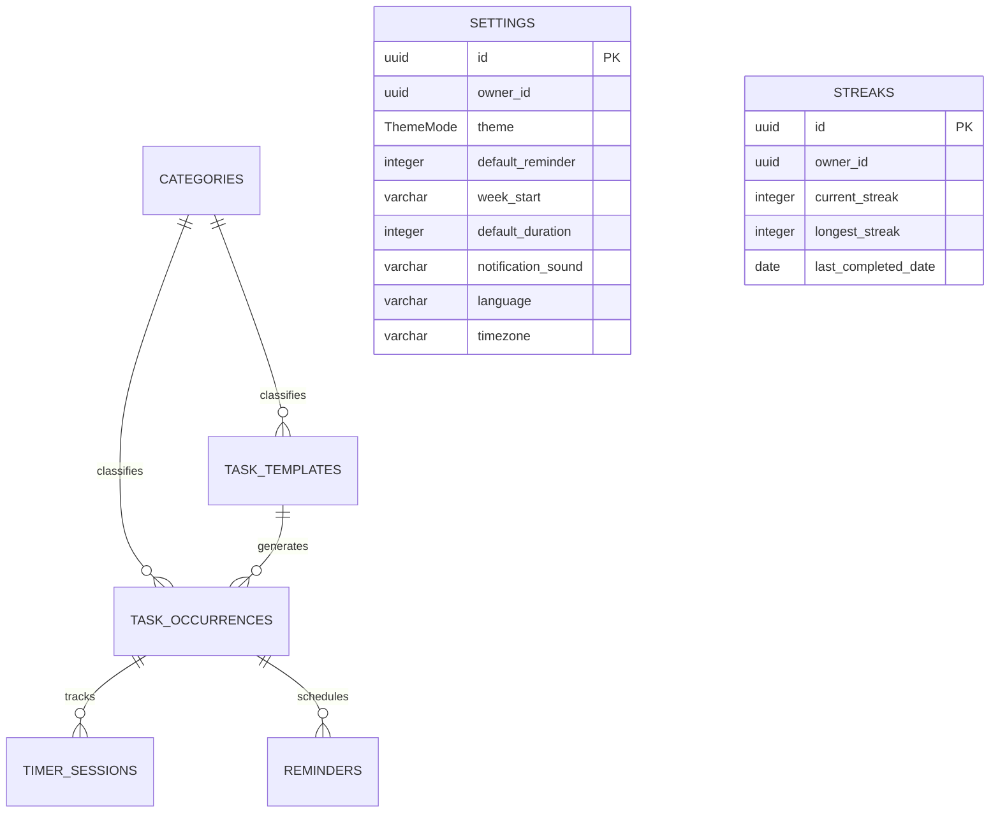

# DailyTask - Database Design Specification (Improved)

This document details the database architecture, schema definitions, entity relationships, and core database operations for **DailyTask**, derived directly from the application's `user-flow.md` and `vision.md`.

---

## 1. Architectural Strategy

To support an interconnected **Mobile and Web** experience with offline-first capabilities, the data layer employs a hybrid synchronization model:
* **Client-Side (Local)**: **SQLite** (for iOS/Android using React Native/Flutter) or **IndexedDB/OPFS SQLite** (for the Web). This ensures rapid local writes, instant timer updates, and complete offline usability.
* **Server-Side (Cloud Sync)**: **PostgreSQL** or equivalent relational database. Data is synced incrementally using a sequence/timestamp-based synchronization protocol.

---

## 2. Entity-Relationship Diagram (ERD)

The relational schema uses a **parent-child separation model** for recurring tasks. All primary keys (`PK`) and foreign keys (`FK`) use **UUIDs** to ensure unique IDs across all devices and server instances.



---

## 3. Data Dictionary & Custom Enums

### 3.1 Custom Database Enums
To prevent invalid statuses and maintain strict data integrity, custom database types are used.

* **In PostgreSQL**: Enforced via native `CREATE TYPE` enums.
* **In SQLite**: Enforced using `CHECK (column IN (...))` constraints on `TEXT` columns.

```sql
CREATE TYPE TaskStatus AS ENUM ('TODO', 'IN_PROGRESS', 'COMPLETED');
CREATE TYPE ReminderStatus AS ENUM ('PENDING', 'SNOOZED', 'DISMISSED', 'TRIGGERED');
CREATE TYPE RecurrenceType AS ENUM ('NONE', 'DAILY', 'RECURRING', 'CUSTOM');
CREATE TYPE RecurrenceInterval AS ENUM ('DAILY', 'WEEKLY', 'MONTHLY', 'YEARLY');
CREATE TYPE ThemeMode AS ENUM ('light', 'dark', 'system');
```

---

### 3.2 Design Note: Data Duplication & Denormalization
In `task_occurrences`, we duplicate fields such as `title`, `description`, `category_id`, `start_time`, and `time_to_complete` from the parent `task_templates` record. 
This design choice is deliberate to support **"Current Day Only" edits (Flow C)**. If a user modifies only today's task occurrence, the system toggles `is_detached = TRUE` and modifies the local record columns in `task_occurrences` directly. This decouples that specific instance from the parent recurrence chain without breaking or altering the master template (`task_templates`) or other daily occurrences.

---

### 3.3 Table: `categories`
Stores default and user-defined task categories, which are used to group and filter tasks.

| Column Name | Data Type | Constraints | Default Value | Description |
| :--- | :--- | :--- | :--- | :--- |
| `id` | UUID | PRIMARY KEY | Gen Random UUID | Unique identifier for the category. |
| `owner_id` | UUID | NULL | `NULL` | Owner of the category. Kept `NULL` for v1 single-user mode. |
| `name` | VARCHAR(50) | NOT NULL | | Display name (e.g., "Work", "Study"). |
| `icon_path` | VARCHAR(255) | NOT NULL | | File path or URL to the icon image (supports custom uploads). |
| `is_system` | BOOLEAN | NOT NULL | `FALSE` | `TRUE` for default presets (Work, Personal, etc.); cannot be deleted. |
| `color_hex` | VARCHAR(7) | NOT NULL | `"#808080"` | HEX code representing category color in UI. |
| `created_at`| TIMESTAMP | NOT NULL | `CURRENT_TIMESTAMP`| Sync metadata: Creation timestamp. |
| `updated_at`| TIMESTAMP | NOT NULL | `CURRENT_TIMESTAMP`| Sync metadata: Last update timestamp. |
| `deleted_at`| TIMESTAMP | NULL | `NULL` | Sync metadata: Nullable soft-delete timestamp. |
| `sync_version`| INTEGER | NOT NULL | `1` | Sync metadata: Increments on every modification. |

---

### 3.4 Table: `task_templates`
Stores the master definition of a task, including its schedule and recurrence configurations.

| Column Name | Data Type | Constraints | Default Value | Description |
| :--- | :--- | :--- | :--- | :--- |
| `id` | UUID | PRIMARY KEY | Gen Random UUID | Unique identifier for the master task template. |
| `owner_id` | UUID | NULL | `NULL` | Owner of the template. Kept `NULL` for v1 single-user mode. |
| `category_id`| UUID | FOREIGN KEY | REFERENCES `categories(id)` | Associated category. |
| `title` | VARCHAR(100) | NOT NULL | | Task title. |
| `description`| TEXT | NULL | | Optional detail description. |
| `start_date` | DATE | NOT NULL | | Day on which the schedule begins. |
| `due_date` | DATE | NULL | | Optional final date (used for due-date persistence). |
| `start_time` | TIME | NOT NULL | | Scheduled start time of the task (e.g. '14:30:00'). |
| `time_to_complete`| INTEGER | NOT NULL | | Estimated task duration in minutes. |
| `reminder_enabled`| BOOLEAN | NOT NULL | `FALSE` | Toggle for reminder notifications. |
| `recurrence_type`| RecurrenceType | NOT NULL | `"NONE"` | Repetition behavior classification. |
| `recurrence_interval`| RecurrenceInterval| NULL | | Interval frequency. |
| `custom_days`| VARCHAR(50) | NULL | | Comma-separated active days (e.g., `"MON,WED,FRI"`) if recurrence type is CUSTOM. |
| `created_at`| TIMESTAMP | NOT NULL | `CURRENT_TIMESTAMP`| Sync metadata: Creation timestamp. |
| `updated_at`| TIMESTAMP | NOT NULL | `CURRENT_TIMESTAMP`| Sync metadata: Last update timestamp. |
| `deleted_at`| TIMESTAMP | NULL | `NULL` | Sync metadata: Nullable soft-delete timestamp. |
| `sync_version`| INTEGER | NOT NULL | `1` | Sync metadata: Increments on every modification. |

---

### 3.5 Table: `task_occurrences`
Stores concrete, day-to-day task occurrences. Tasks page, dashboard, and timers operate directly on this table.

| Column Name | Data Type | Constraints | Default Value | Description |
| :--- | :--- | :--- | :--- | :--- |
| `id` | UUID | PRIMARY KEY | Gen Random UUID | Unique identifier for the occurrence. |
| `owner_id` | UUID | NULL | `NULL` | Owner of the occurrence. Kept `NULL` for v1 single-user mode. |
| `task_template_id`| UUID | FOREIGN KEY, NULL | REFERENCES `task_templates(id)` ON DELETE SET NULL | Parent template. `NULL` if task is decoupled/current-day-only. |
| `date` | DATE | NOT NULL | | The specific date of this occurrence. |
| `title` | VARCHAR(100) | NOT NULL | | Cloned from `task_templates.title` (permits decoupled edits). |
| `description`| TEXT | NULL | | Cloned from `task_templates.description`. |
| `category_id`| UUID | FOREIGN KEY | REFERENCES `categories(id)` | Cloned from `task_templates.category_id`. |
| `start_time` | TIME | NOT NULL | | Cloned from `task_templates.start_time`. |
| `time_to_complete`| INTEGER | NOT NULL | | Cloned from `task_templates.time_to_complete` (duration in minutes). |
| `status` | TaskStatus | NOT NULL | `"TODO"` | Current state: `TODO`, `IN_PROGRESS`, `COMPLETED`. |
| `elapsed_time`| INTEGER | NOT NULL | `0` | Actual total time spent tracking this task (in seconds). |
| `reminder_enabled`| BOOLEAN | NOT NULL | `FALSE` | Cloned from `task_templates.reminder_enabled`. |
| `is_detached`| BOOLEAN | NOT NULL | `FALSE` | `TRUE` if the occurrence was edited for "current day only" (Flow C). |
| `created_at`| TIMESTAMP | NOT NULL | `CURRENT_TIMESTAMP`| Sync metadata: Creation timestamp. |
| `updated_at`| TIMESTAMP | NOT NULL | `CURRENT_TIMESTAMP`| Sync metadata: Last update timestamp. |
| `deleted_at`| TIMESTAMP | NULL | `NULL` | Sync metadata: Nullable soft-delete timestamp. |
| `sync_version`| INTEGER | NOT NULL | `1` | Sync metadata: Increments on every modification. |

---

### 3.6 Table: `timer_sessions`
Stores all timer activity. In addition to preserving the active timer state across app closures (where `is_active = TRUE`), this table provides historic data tracking for future user analytics.

| Column Name | Data Type | Constraints | Default Value | Description |
| :--- | :--- | :--- | :--- | :--- |
| `id` | UUID | PRIMARY KEY | Gen Random UUID | Unique identifier. |
| `owner_id` | UUID | NULL | `NULL` | Owner of the session. Kept `NULL` for v1 single-user mode. |
| `task_occurrence_id`| UUID | FOREIGN KEY | REFERENCES `task_occurrences(id)` ON DELETE CASCADE | Associated task occurrence. |
| `start_time` | TIMESTAMP | NOT NULL | | Timestamp when play/start was clicked. |
| `end_time` | TIMESTAMP | NULL | `NULL` | Timestamp when pause/complete was clicked. `NULL` if active. |
| `is_active` | BOOLEAN | NOT NULL | `TRUE` | `TRUE` if currently running. Only **one record** can be active at a time. |
| `created_at`| TIMESTAMP | NOT NULL | `CURRENT_TIMESTAMP`| Sync metadata: Creation timestamp. |
| `updated_at`| TIMESTAMP | NOT NULL | `CURRENT_TIMESTAMP`| Sync metadata: Last update timestamp. |
| `deleted_at`| TIMESTAMP | NULL | `NULL` | Sync metadata: Nullable soft-delete timestamp. |
| `sync_version`| INTEGER | NOT NULL | `1` | Sync metadata: Increments on every modification. |

> **Single-Active Trigger (SQLite Partial Unique Index)**:
> To enforce the "One Active Timer at a Time" constraint across database clients, configure a partial unique index:
> `CREATE UNIQUE INDEX uidx_active_session ON timer_sessions(owner_id) WHERE is_active = TRUE;` (This handles NULL values or distinct users cleanly).

---

### 3.7 Table: `reminders`
Schedules alarm instances. Handles snooze states and keeps alarms alive in background processes.

| Column Name | Data Type | Constraints | Default Value | Description |
| :--- | :--- | :--- | :--- | :--- |
| `id` | UUID | PRIMARY KEY | Gen Random UUID | Unique identifier. |
| `owner_id` | UUID | NULL | `NULL` | Owner of the reminder. Kept `NULL` for v1. |
| `task_occurrence_id`| UUID | FOREIGN KEY | REFERENCES `task_occurrences(id)` ON DELETE CASCADE | Target task occurrence. |
| `scheduled_time`| TIMESTAMP | NOT NULL | | When the notification alarm should fire. |
| `status` | ReminderStatus | NOT NULL | `"PENDING"` | Alarm state: `PENDING`, `SNOOZED`, `DISMISSED`, `TRIGGERED`. |
| `snooze_count`| INTEGER | NOT NULL | `0` | Number of times the notification has been snoozed. |
| `created_at`| TIMESTAMP | NOT NULL | `CURRENT_TIMESTAMP`| Sync metadata: Creation timestamp. |
| `updated_at`| TIMESTAMP | NOT NULL | `CURRENT_TIMESTAMP`| Sync metadata: Last update timestamp. |
| `deleted_at`| TIMESTAMP | NULL | `NULL` | Sync metadata: Nullable soft-delete timestamp. |
| `sync_version`| INTEGER | NOT NULL | `1` | Sync metadata: Increments on every modification. |

---

### 3.8 Table: `settings`
Stores core user customization configurations.

| Column Name | Data Type | Constraints | Default Value | Description |
| :--- | :--- | :--- | :--- | :--- |
| `id` | UUID | PRIMARY KEY | Gen Random UUID | Unique identifier. |
| `owner_id` | UUID | UNIQUE, NULL | `NULL` | Exactly one settings record per user. Kept `NULL` for v1. |
| `theme` | ThemeMode | NOT NULL | `"system"` | Visual interface mode: `light`, `dark`, `system`. |
| `default_reminder`| INTEGER | NOT NULL | `10` | Default alarm buffer in minutes before task starts. |
| `week_start` | VARCHAR(15) | NOT NULL | `"Monday"` | Calendar week starting day: `Sunday`, `Monday`. |
| `default_duration`| INTEGER | NOT NULL | `30` | Default time block duration in minutes. |
| `notification_sound`| VARCHAR(50) | NOT NULL | `"default"` | Selected alert tone. |
| `language` | VARCHAR(10) | NOT NULL | `"en"` | Standard language localization code (e.g. `en`, `es`). |
| `timezone` | VARCHAR(50) | NOT NULL | `"UTC"` | Timezone reference (e.g. `"America/New_York"`). |
| `created_at`| TIMESTAMP | NOT NULL | `CURRENT_TIMESTAMP`| Sync metadata: Creation timestamp. |
| `updated_at`| TIMESTAMP | NOT NULL | `CURRENT_TIMESTAMP`| Sync metadata: Last update timestamp. |
| `deleted_at`| TIMESTAMP | NULL | `NULL` | Sync metadata: Nullable soft-delete timestamp. |
| `sync_version`| INTEGER | NOT NULL | `1` | Sync metadata: Increments on every modification. |

---

### 3.9 Table: `streaks`
Maintains daily streak statistics for gamification and motivational dashboard metrics.

| Column Name | Data Type | Constraints | Default Value | Description |
| :--- | :--- | :--- | :--- | :--- |
| `id` | UUID | PRIMARY KEY | Gen Random UUID | Unique identifier. |
| `owner_id` | UUID | UNIQUE, NULL | `NULL` | Exactly one streaks tally per user. Kept `NULL` for v1. |
| `current_streak`| INTEGER | NOT NULL | `0` | Consecutive days with at least 1 task completion. |
| `longest_streak`| INTEGER | NOT NULL | `0` | Historic record streak. |
| `last_completed_date`| DATE | NULL | | Date of the most recently completed task. |
| `created_at`| TIMESTAMP | NOT NULL | `CURRENT_TIMESTAMP`| Sync metadata: Creation timestamp. |
| `updated_at`| TIMESTAMP | NOT NULL | `CURRENT_TIMESTAMP`| Sync metadata: Last update timestamp. |
| `deleted_at`| TIMESTAMP | NULL | `NULL` | Sync metadata: Nullable soft-delete timestamp. |
| `sync_version`| INTEGER | NOT NULL | `1` | Sync metadata: Increments on every modification. |

---

## 4. Key Queries & Database Operations

### 4.1 Conflict Detection (Add Task Check)
Before adding or shifting an occurrence to a target `Date` and `Start Time`, the system checks for overlaps:
* **Time Block**: `[start_time]` to `[start_time + time_to_complete]`
* **Query**:
```sql
SELECT title, start_time, time_to_complete 
FROM task_occurrences 
WHERE date = :target_date
  AND deleted_at IS NULL
  AND (
    -- Case 1: New task starts inside an existing task duration
    (:new_start_time BETWEEN start_time AND datetime(start_time, '+' || time_to_complete || ' minutes'))
    OR
    -- Case 2: Existing task starts inside the new task's duration
    (start_time BETWEEN :new_start_time AND datetime(:new_start_time, '+' || :new_time_to_complete || ' minutes'))
  );
```

---

### 4.2 Startup Flow (Restore Running Timer)
To prevent timing inaccuracies upon reopen, load the active session from `timer_sessions`:
```sql
SELECT 
    o.id AS task_occurrence_id,
    o.title,
    o.status,
    o.elapsed_time AS total_saved_elapsed,
    s.start_time AS session_start_timestamp
FROM timer_sessions s
JOIN task_occurrences o ON s.task_occurrence_id = o.id
WHERE s.is_active = TRUE
  AND s.deleted_at IS NULL;
```
* **Application Calculation**:
$$\text{Current Running Elapsed (seconds)} = (\text{Current System Timestamp} - \text{session\_start\_timestamp}) + \text{total\_saved\_elapsed}$$

---

### 4.3 Midnight Scheduler (00:00 Rollover Generation)
Executed automatically to load occurrences for the new date (`:today_date`):

1. **Insert Daily Tasks**:
```sql
INSERT INTO task_occurrences (id, task_template_id, date, title, description, category_id, start_time, time_to_complete, reminder_enabled, status)
SELECT gen_random_uuid(), id, :today_date, title, description, category_id, start_time, time_to_complete, reminder_enabled, 'TODO'::TaskStatus
FROM task_templates
WHERE deleted_at IS NULL
  AND (recurrence_type = 'DAILY' 
       OR (recurrence_type = 'RECURRING' AND recurrence_interval = 'DAILY'));
```

2. **Carry Forward Due-Date Tasks**:
Find custom templates with due dates that are active today and do not yet have an active completed occurrence:
```sql
INSERT INTO task_occurrences (id, task_template_id, date, title, description, category_id, start_time, time_to_complete, reminder_enabled, status)
SELECT gen_random_uuid(), id, :today_date, title, description, category_id, start_time, time_to_complete, reminder_enabled, 'TODO'::TaskStatus
FROM task_templates t
WHERE t.deleted_at IS NULL
  AND t.recurrence_type = 'CUSTOM' 
  AND t.due_date IS NOT NULL 
  AND :today_date <= t.due_date
  AND NOT EXISTS (
      -- Verify it isn't already completed
      SELECT 1 FROM task_occurrences WHERE task_template_id = t.id AND status = 'COMPLETED' AND deleted_at IS NULL
  )
  AND NOT EXISTS (
      -- Avoid duplicates on today's agenda
      SELECT 1 FROM task_occurrences WHERE task_template_id = t.id AND date = :today_date AND deleted_at IS NULL
  );
```

---

### 4.4 Timer Play/Pause & Single Timer Constraint
When the user plays a timer for `target_task_occurrence_id`:

1. **Pause any active timer**:
```sql
-- Step 1: Log the end time and deactivate the current session
UPDATE timer_sessions
SET end_time = CURRENT_TIMESTAMP,
    is_active = FALSE,
    updated_at = CURRENT_TIMESTAMP,
    sync_version = sync_version + 1
WHERE is_active = TRUE;

-- Step 2: Accumulate the elapsed time in the task_occurrences table
UPDATE task_occurrences
SET elapsed_time = elapsed_time + (strftime('%s', CURRENT_TIMESTAMP) - (SELECT strftime('%s', start_time) FROM timer_sessions WHERE task_occurrence_id = id AND is_active = FALSE ORDER BY end_time DESC LIMIT 1)),
    status = 'TODO'::TaskStatus,
    updated_at = CURRENT_TIMESTAMP,
    sync_version = sync_version + 1
WHERE id = (SELECT task_occurrence_id FROM timer_sessions ORDER BY end_time DESC LIMIT 1);
```

2. **Start the new timer**:
```sql
-- Step 1: Set status to IN_PROGRESS
UPDATE task_occurrences 
SET status = 'IN_PROGRESS'::TaskStatus, 
    updated_at = CURRENT_TIMESTAMP,
    sync_version = sync_version + 1 
WHERE id = :target_task_occurrence_id;

-- Step 2: Register in timer_sessions
INSERT INTO timer_sessions (id, task_occurrence_id, start_time, is_active)
VALUES (gen_random_uuid(), :target_task_occurrence_id, CURRENT_TIMESTAMP, TRUE);
```

---

### 4.5 Dashboard Analytics & Graph Queries

#### 1. Time Spent Comparison Graph (Daily total seconds)
```sql
SELECT date, SUM(elapsed_time) AS total_seconds_spent
FROM task_occurrences
WHERE date BETWEEN :start_of_week AND :end_of_week
  AND deleted_at IS NULL
GROUP BY date
ORDER BY date ASC;
```

#### 2. Daily Task Completion Rate Graph
```sql
SELECT 
    date,
    COUNT(CASE WHEN status = 'COMPLETED' THEN 1 END) AS completed_count,
    COUNT(id) AS total_count,
    (CAST(COUNT(CASE WHEN status = 'COMPLETED' THEN 1 END) AS REAL) / COUNT(id)) * 100 AS completion_rate
FROM task_occurrences
WHERE date BETWEEN :start_of_week AND :end_of_week
  AND deleted_at IS NULL
GROUP BY date
ORDER BY date ASC;
```

---

### 4.6 Category Cascading Deletion (Fallback)
If a user deletes a custom category, reassign all associated templates and occurrences to the "Others" system category before executing soft-delete:
```sql
-- Step 1: Reassign master templates
UPDATE task_templates 
SET category_id = '00000000-0000-0000-0000-000000000006'::UUID, -- "Others" fallback UUID
    updated_at = CURRENT_TIMESTAMP, 
    sync_version = sync_version + 1 
WHERE category_id = :deleted_category_id;

-- Step 2: Reassign current daily occurrences
UPDATE task_occurrences 
SET category_id = '00000000-0000-0000-0000-000000000006'::UUID, 
    updated_at = CURRENT_TIMESTAMP, 
    sync_version = sync_version + 1 
WHERE category_id = :deleted_category_id;

-- Step 3: Soft-delete category
UPDATE categories 
SET deleted_at = CURRENT_TIMESTAMP, 
    sync_version = sync_version + 1 
WHERE id = :deleted_category_id AND is_system = FALSE;
```
