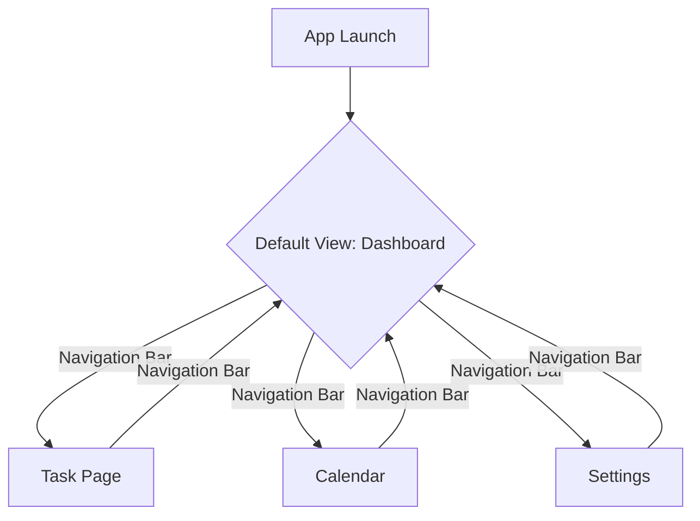
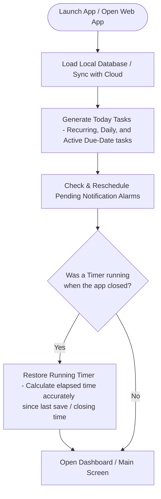
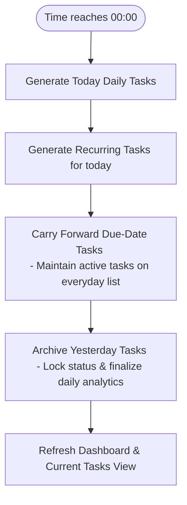
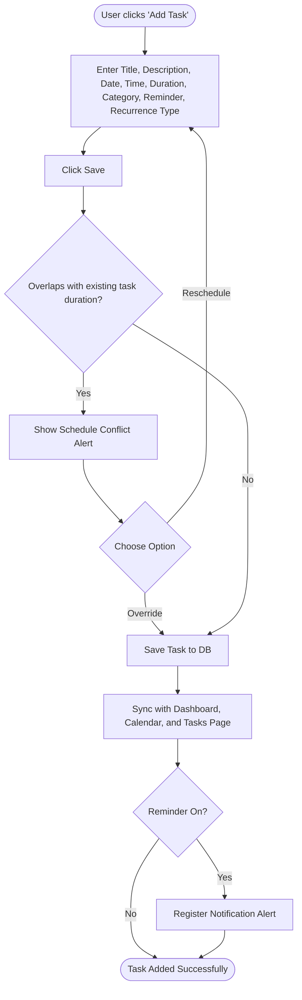
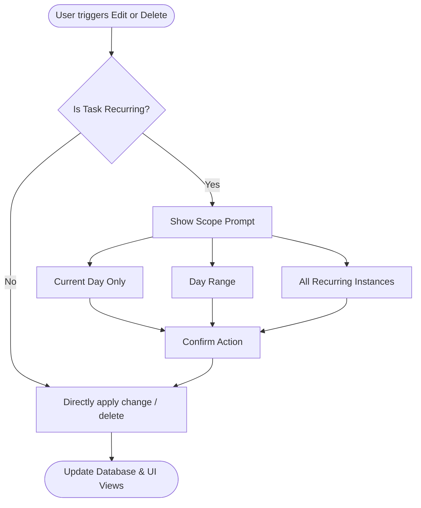
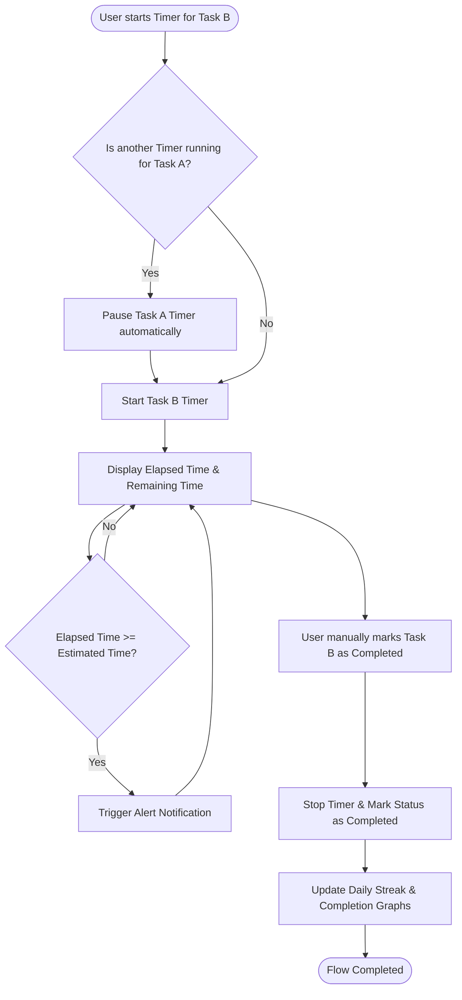
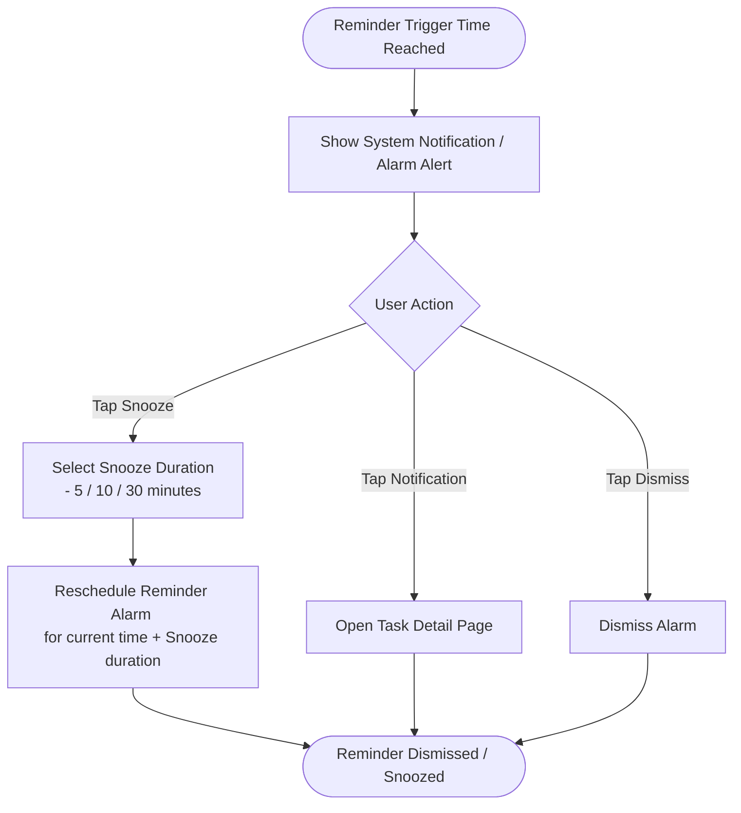

# DailyTask - User Flow & Journey Specification

This document details the complete end-to-end user flows, system interactions, and transition logic for **DailyTask**, based on the project's Core Vision.

DailyTask is designed as an interconnected Mobile and Web application for individuals to track, schedule, track time, and alert them about their daily tasks and schedules.

---

## 1. High-Level App Architecture & Navigation

The application is structured around four primary navigation hubs, accessible via a bottom navigation bar (mobile) or side navigation panel (web).

---

## 2. App Lifecycle & Startup Flow

This flow defines the sequence of operations executed whenever the user launches the application, brings it from the background, or refreshes the page.

### Step-by-Step Flow:
1. **Launch App**: User opens the mobile app or loads/refreshes the web app.
2. **Load Database**: System initializes the local database (SQLite/IndexedDB) and synchronizes data with the cloud server if internet is available.
3. **Generate Today's Tasks**: Runs the core task generation engine to populate the current daily agenda (pulls daily tasks, recurring tasks for today, and uncompleted due-date tasks).
4. **Check Pending Notifications**: Scans alarm schedules and registers/updates system alarm events for today's tasks.
5. **Restore Running Timer**: Detects if a timer was running when the app was closed or suspended, recalculates elapsed time accurately from saved timestamps, and restores the active state.
6. **Open Dashboard**: Opens the dashboard screen, showcasing today's tasks and the restored active timer (if applicable).

---

## 3. Midnight Scheduler Flow

To ensure consistency for overnight users and background sync, the system schedules an automatic transition at precisely 00:00 (midnight).

### Step-by-Step Flow:
1. **Clock Trigger (00:00)**: System triggers the date boundary check.
2. **Generate Today's Daily Tasks**: Automatically duplicates and posts tasks marked for the "Daily Task" recurrence pattern.
3. **Generate Recurring Tasks**: Processes intervals (weekly, monthly, yearly) and generates tasks matching today's date.
4. **Carry Forward Due-Date Tasks**: Locates tasks that have a defined due date which has not yet expired and propagates them onto today's tasks list.
5. **Archive Yesterday**: Marks the previous day's non-persistent tasks as complete/incomplete, locking tracking statistics, and archiving metrics.
6. **Refresh Dashboard**: Refreshes the active UI views, ensuring the user is greeted with a clean, updated day's list without needing to reload the application.

---

## 4. Core User Flows

### Flow A: Add Task & Schedule Conflict Resolution
The success of DailyTask hinges on its schedule conflict detection. When a task is added, the app reserves a time block defined by `Start Time` and `Time-to-Complete`.

#### Step-by-Step Flow:
1. **Initiate**: User taps the **"+" (Add Task)** button from any screen (Dashboard, Task Page, or Calendar).
2. **Form Entry**: User fills out the task details:
   - **Title** (Required)
   - **Description** (Optional)
   - **Date** (Required)
   - **Start Time** (Required)
   - **Time-to-Complete** (Required; e.g., 2 hours 30 minutes)
   - **Category** (Select from: Work, Personal, Study, Health, Life, Others, or Custom categories)
   - **Reminder** (On/Off Toggle)
   - **Recurrence Settings (Type)**:
     - *Daily Task*: Repeated every day.
     - *Recurring Task*: Select interval (`Daily`, `Weekly`, `Monthly`, `Yearly`).
     - *Custom Task*: Select custom schedule (e.g., repeating specific weekdays), mark as non-recurring, or assign a specific due date.
       - **Due Date Persistence**: If a Custom Task has an active due date, it is treated as a persistent daily task. It will automatically populate the everyday tasks list and dashboard day-after-day until the due date ends.
3. **Save Validation & Conflict Detection**:
   - The system calculates the task window: `[Start Time]` to `[Start Time + Time-to-Complete]` (e.g., if set for 2:30 PM with 2 hours time-to-complete, the blocked window is 2:30 PM - 4:30 PM).
   - The system checks the database for existing tasks scheduled on that `Date` overlapping with this window.
4. **Resolution Branching**:
   - **No Conflict**: The task is saved directly.
   - **Conflict Detected**: An alert dialog appears detailing the overlap (e.g., *"Schedule overlap with 'French Class' (2:30 PM - 4:30 PM). Would you like to Override or Reschedule?"*).
     - **Reschedule**: User returns to the form to change time/date/duration.
     - **Override**: User forces the overlap, saving the task.
5. **Post-Save Actions**:
   - The task is added to the **Calendar**.
   - The task is added to the **Dashboard** (for the relevant day).
   - The task is added to the **Task Page**.
   - If Reminders are enabled, a system notification/alert is registered.

---

### Flow B: Task List Management (Task Page)
The Task Page acts as the daily agenda hub. It is split into **To Do**, **In Progress**, and **Completed** sections.

#### Step-by-Step Flow:
1. **View Daily Tasks**: User navigates to the **Task Page**.
2. **Search & Filter**:
   - User types in the **Search Bar** to instantly filter tasks by title/description.
   - User clicks the **Filter Dropdown** to filter tasks by Category (e.g., *Work*, *Health*, *Study*).
3. **Selection & Action**:
   - User toggles select boxes on individual tasks.
   - Upon selecting one or more tasks, an action bar appears offering options to **Edit** or **Delete**.

---

### Behavior of Tasks with Due Dates

When a Custom Task is assigned a **Due Date**, the system activates a special persistent scheduling mechanism:

1. **Everyday Agenda Propagation**: 
   - Instead of only showing up on its creation or start date, the task is automatically carried forward and populated into the everyday tasks list (**To Do** section on the Task Page and Dashboard) for each consecutive day.
2. **Lifespan**:
   - The task remains active and visible on each daily list from its starting date up until the specified due date ends.
3. **Daily Conflict Evaluation**:
   - For each day the task is active, its specific scheduled time block (`Start Time` to `Start Time + Time-to-Complete`) is reserved. 
   - Adding any other task overlapping with this block on any of these days will trigger the **Schedule Conflict Alert** (Flow A).
4. **Completion behavior**:
   - Once the user manually marks the task as **Completed**, it transitions to the **Completed** section on the Task Page/Dashboard and stops propagating to subsequent days.

---

### Flow C: Recurrence-Aware Edit & Delete
When a task is modified or deleted, the system determines if it is a recurring task and prompts the user accordingly to maintain database integrity.

#### Edit Flow:
1. User clicks **Edit** on a task.
2. Form opens pre-filled with current details.
3. User edits fields and clicks **Save**.
4. **Recurrence Prompt** (if task is recurring):
   - *Current Day Only*: Only modifies today's instance (splits it from the recurrence chain).
   - *Day Range*: Applies changes only to instances within a chosen date range.
   - *All Recurring*: Updates all instances of the recurring series.
5. If time/date changed, triggers **Flow A's Conflict Detection**.

#### Delete Flow:
1. User clicks **Delete** on a task.
2. **Recurrence Prompt** (if task is recurring):
   - *Current Day Only*: Deletes only today's instance.
   - *Day Range*: Deletes instances within a selected date range.
   - *All Recurring*: Deletes all instances of the recurring series.
3. Confirming deletion removes the task(s) from lists, calendar, and cancels any active reminders.

---

### Flow D: Timer & Time Tracking
DailyTask provides active tracking with a strict "One Active Timer at a Time" constraint to ensure focused single-tasking.

#### Step-by-Step Flow:
1. **Start**: User clicks the **Start (Play)** button on any task card (from Dashboard or Task Page).
2. **Conflict Pause**: The system checks if another task timer is running.
   - If another timer is active, the system automatically **pauses** the current running timer before starting the new one.
3. **Tracking Display**:
   - The active task displays **Elapsed Time** (incrementing live).
   - The task displays **Remaining Time** (calculated as `Estimated Time-to-Complete - Elapsed Time`).
4. **Pause/Resume**: User can click **Pause** to stop tracking, and **Resume** to continue.
5. **Timer Persistence & Crash Resilience**:
   - **If App Closes / Terminates**: If the user closes the app, locks their device, or if the OS terminates the app while a timer is active, the system writes the state (`Task ID`, `Last Start Timestamp`, and `Last Saved Elapsed Duration`) into the persistent local database.
   - **Reopen App**: Upon reload, the system automatically retrieves this persistent data, calculates the elapsed time difference `Elapsed Duration = (Current Time - Last Start Timestamp) + Last Saved Elapsed Duration`, and seamlessly restores the active running timer state with millisecond accuracy.
6. **Completion Alert (Success Criteria)**:
   - When the running timer elapsed time reaches the estimated **Time-to-Complete**:
     - System triggers a **Notification/Alert** ("Estimated time reached!").
     - **Important**: The task is *not* auto-completed.
     - The timer keeps running to track overtime.
7. **Manual Completion**:
   - The user must manually check the **Complete** box or tap **Mark Completed**.
   - This moves the task to **Completed** status, stops the timer, and updates dashboard metrics.

---

### Flow E: Monthly Calendar Navigation
1. User navigates to the **Calendar Page**.
2. Displays a clean **Monthly Calendar Grid**, with dots or color markers representing scheduled tasks.
3. User clicks on any **Date**:
   - Displays a clean daily agenda list below the calendar grid showing tasks for that day.
4. User clicks on any **Task** in the list:
   - Opens action overlay showing task details.
   - User can click **Edit** or **Delete** (initiates **Flow C**).

---

### Flow F: Settings & Custom Categories
Users can customize the task categories dynamically.

#### Step-by-Step Flow:
1. User navigates to **Settings**.
2. Tap **Categories Management**.
3. User sees list of existing categories: *Work*, *Personal*, *Study*, *Health*, *Life*, *Others*.
4. **To Add New Category**:
   - Click **Add Custom Category**.
   - Input custom category name.
   - Tap **Icon Selector** to choose/upload an icon. User can upload/add an image instantly.
   - Save. The new category is now available in the Add Task category list.
5. **To Edit/Delete Categories**:
   - Tap Edit/Delete on any custom category.
   - If deleting a category in-use, system warns user that affected tasks will be reassigned to "Others".

---

### Flow G: Reminder & Notification Behavior

Reminders are triggered by local/push system alarm notifications configured during task creation.

#### Step-by-Step Flow:
1. **Trigger**: System timer reaches the scheduled task reminder time.
2. **Notification Appears**: System triggers an in-app banner or native OS push notification with action buttons.
3. **User Choice**:
   - **Open Task**: Tapping the notification launches the app and opens the specific Task Detail view.
   - **Dismiss**: Tapping the "Dismiss" action stops the alarm sound and clears the notification from the tray.
   - **Snooze**: Tapping "Snooze" presents options of **5, 10, or 30 minutes**.
4. **Snooze Rescheduling**: Selecting a snooze duration automatically registers a new system alarm scheduled for `Snooze Duration` minutes in the future.

---

## 5. Dashboard Analytics & Streaks

The **Dashboard** serves as the user's primary workspace overview. It updates dynamically when tasks are tracking or completed.

1. **Daily Streak Tracker**:
   - Displays current daily streak count (days with at least 1 completed task).
   - If today's first task is marked completed, the streak visual triggers a celebration state and increments.
2. **Time Spent Comparison Graph**:
   - Displays a bar/line graph comparing total active tracked time across days of the week.
3. **Task Completion Rate Graph**:
   - Compares the ratio of completed vs. scheduled tasks on a day-by-day basis.
4. **Addition of new tasks**:
   - Updates the display of current day's tasks and due dates coming up.
